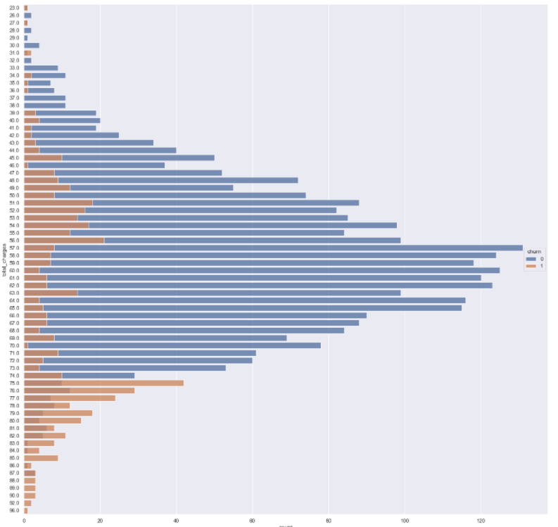

# SyriaTel Customer Churn Analysis
The objective is to analyze customer churn data from SyriaTel and create a classification model in order to predict whether a customer will decide to terminate their service with SyriaTel in the near future.

The model is designed to help the company determine what aspects of their service are most likely to cause customers to churn in order to improve those things to prevent churn and loss of revenue.

# Model

Various models were tested, but the final model is based on the XGBoost base model.

When evaluating the various model, Precision and F1 Score were the main focus.
XGBoost provided the highest Precision and F1 Score.

The model predicted no false negatives, but it did predict false positives at a rate of 17%.

For this business case, false positives were fine, as they represent the model predicting a churning customer that will end up staying with the company.

The top features based on importance to the model are total charges, voice mail plan, customer service calls, international charges, and international plan.

# Feature Evaluation

## Total Charges

Customers that churn seem to be unhappy with the total charges of their service.

As this chart shows, the higher the total charge for a customer, the more likely that customer is to churn.

In fact, the average total charge of a customer that churn is $65.35 as opposed to $58.45 for a customer that doesn't churn.

## International Plan 

The international plan has a very low customer base but a very high churn percentage among the subscribers.

Only 11% of SyriaTel customers have an international plan and of that 11%, 42% are likely to churn. 

Also, the charge per minute for an international call for someone who has the international plan is almost the same as the charge per minute for an international call for someone who doesn't have an international plan.

The charge rate is 27 cents per minute regardless of whether you have an international plan or not.

## Customer Service Calls

Calls to customer service seem to also be a factor in churn.

In fact, out of the customers that have made three or more calls to customer service, 52% of them end up churning.

# Recommendations
* Evaluate the rates we’re charging our customers.
    - Customers seem to be displeased with the high rates, as those who are charged the most tend to be more likely to churn.
* Give more advertisement to our voicemail plan.
    - With the low number of people that are subscribed to our voicemail plan, it seems that some customers might simply be unaware that we offer one.
* Evaluate customer service and what we might be able to do better to assist the customer.
    - Customers making more than 3 service calls are churning at over 50%. 
    - Additional training for customer service staff might be needed, but it also could be related to other factors.
* Research whether an international plan is worth providing, and if it is, look at ways that the service might be improved.
    - Very few customers are using an international plan
    - Those that are using it are seeing no cost reduction to their service.